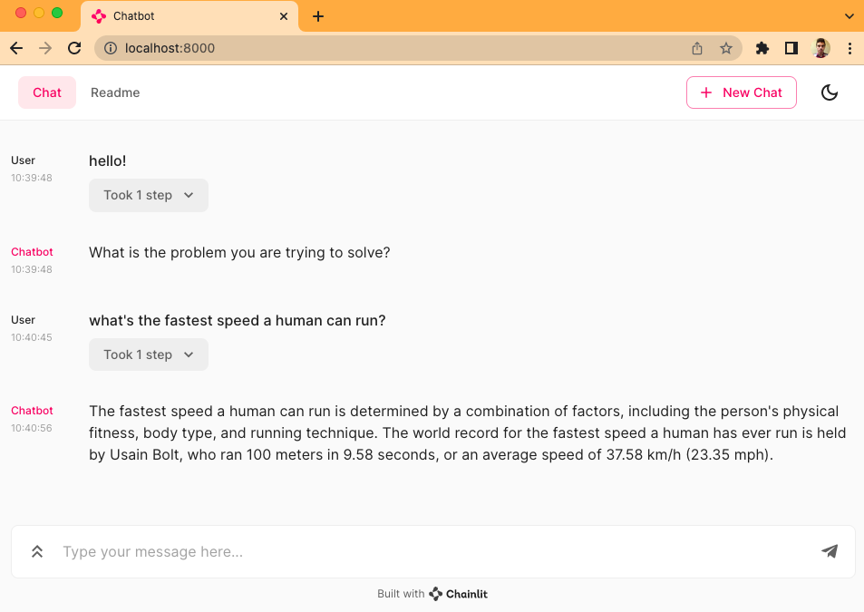

# 🤖 LangChain-Chainlit Web template

⚡ A ready to use AI web application with [](https://github.com/hwchase17/langchain) and [](https://docs.chainlit.io/overview) ⚡

## 🚀 How to use

```bash
# Install corby
pip install corby

# Create a new chatbot
corby new chatbot
```

Select `langchain-chainlit-chatbot` on the list of available templates

